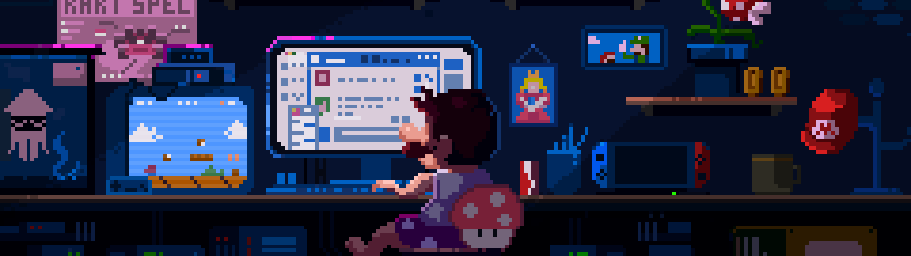

<!---
Mig-uel/Mig-uel is a ✨ special ✨ repository because its `README.md` (this file) appears on your GitHub profile.
You can click the Preview link to take a look at your changes.
--->

<h3>Skills</h3>

  

<h3>Learning</h3>

  

<h3>Stats</h3>

  <picture>
  <source
    srcset="https://github-readme-stats.vercel.app/api?username=mig-uel&theme=radical&show_icons=true"
    media="(prefers-color-scheme: dark)"
  />
  <source
    srcset="https://github-readme-stats.vercel.app/api?username=mig-uel&show_icons=true"
    media="(prefers-color-scheme: light), (prefers-color-scheme: no-preference)"
  />
  
  
</picture>

